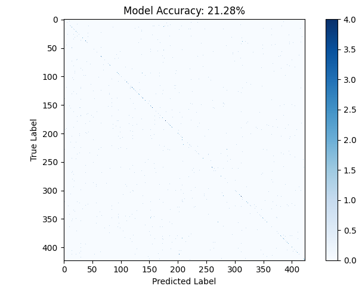

# 🧠 Facial Recognition System (LFW Dataset)

This project implements a **complete facial recognition pipeline** using the **Labeled Faces in the Wild (LFW)** dataset, combining **deep learning models** for feature extraction with a traditional **machine learning classifier**.

---

## 🛠️ 1. Overview of the Pipeline

The facial recognition system is executed in **three core stages**:

### 🧍‍♂️ Face Detection and Alignment
The **MTCNN (Multi-task Cascaded Convolutional Networks)** model is used to accurately detect and extract a face from an input image.

### 🧬 Feature Embedding
A **pre-trained EfficientNet-Lite0** model from **TensorFlow Hub** is employed as a face encoder, converting the cropped face image into a compact, numerical **feature vector (embedding)**.

### 🧩 Classification
A **Support Vector Machine (SVM)** classifier is trained on these embeddings to distinguish between the identities of known individuals.

---

## 📦 2. Dependencies

To run this project, the following Python libraries are required:

| Library | Purpose |
|----------|----------|
| `tensorflow`, `tensorflow_hub` | Deep learning framework and pre-trained EfficientNet model |
| `mtcnn` | Face detection and localization |
| `scikit-learn` | SVM classifier and evaluation metrics |
| `numpy` | Numerical operations |
| `opencv-python (cv2)` | Image loading and preprocessing |
| `matplotlib`, `tqdm` | Plotting and progress bars |

**Installation Command (from the notebook):**
```python
!pip install tensorflow mtcnn scikit-learn tensorflow_hub
```

---

## ⚙️ 3. Implementation Details

### 🗂️ A. Dataset
The project uses a subset of the **Labeled Faces in the Wild (LFW)** dataset.  
A helper function (`download_and_extract_lfw`) is used to manage the dataset download.

For training:
- Only individuals with **at least 5 images** are included.
- A **maximum of 20 samples per person** is used.  
The final training resulted in **423 people** with sufficient samples.

---

### 🧱 B. `FaceRecognitionSystem` Class (Training)

This class manages **data processing, embedding, and classifier training**.

#### 🔄 Preprocessing
- The detected face is **resized to (160, 160)** pixels.
- It is then **normalized to the `[0, 1]` range** and scaled to the `[-1, 1]` range before being passed to the EfficientNet model for embedding.

#### ⚙️ Classifier
- A **Support Vector Machine (SVM)** with a **linear kernel** and a regularization parameter **C = 0.1** is used for the multi-class classification task.

#### 📊 Data Split
- The processed embeddings are split into an **80% training set** and a **20% test set**.

---

### 🔮 C. `FaceRecognitionDemo` Class (Inference)

This class loads the **trained model (saved as a `.pkl` file)** and performs predictions.

#### 🧠 Inference Process
- An input image is passed through the **MTCNN detector** and the **EfficientNet encoder** to get a **face embedding**.  
- The loaded **SVM** then uses this embedding to predict the person's identity and a **confidence score** using the `predict_proba` method.

---

## 📊 4. Results and Visualizations

 📊 **Training Data Distribution** 


The model's performance on the 20% test set is visualized and reported:

### ✅ Model Accuracy
The model achieved an **overall accuracy of 21.28%** on the test set.  




### 🔢 Confusion Matrix
The confusion matrix (shown below) is largely **sparse**, reflecting the low overall accuracy and the challenge of classifying faces among **423 distinct individuals**.

### 📈 Training Data Distribution
The distribution of samples across the **first 10 people** in the training set shows varying numbers of samples per class, illustrating the **imbalanced nature** of the utilized LFW subset.

---

### 🧾 Note on Accuracy
The low accuracy is **expected** for a multi-class identification task with:
- **423 classes** (individuals)
- A **small number of samples per class** (maximum 20)
  
The complexity of the problem, coupled with the relatively simple **SVM classifier**, makes achieving high performance difficult without:
- More **data augmentation**
- **Fine-tuning** of the embedding model
- Or using a **different classifier architecture**

---


---

⭐ *If you found this project useful, please consider giving it a star on GitHub!*
